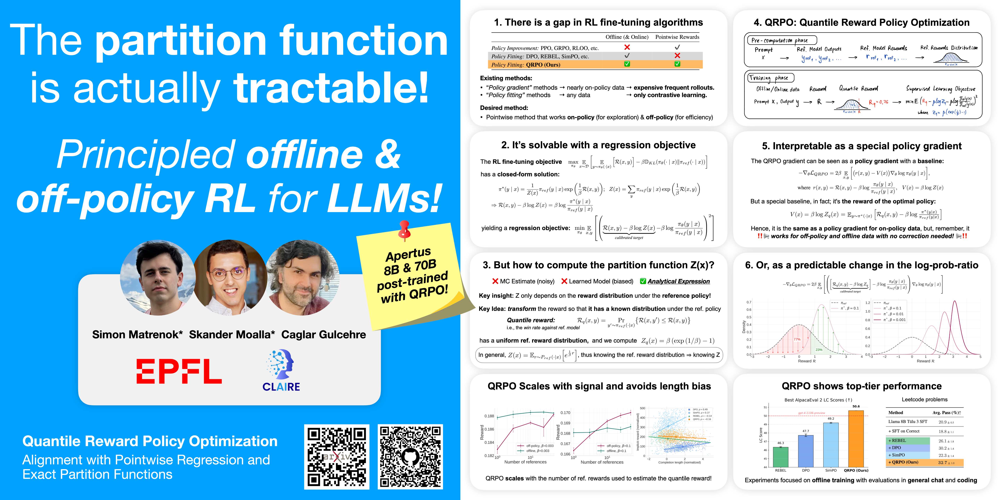

# Quantile Reward Policy Optimization: Alignment with Pointwise Regression and Exact Partition Functions



[](https://arxiv.org/pdf/2507.08068)
[](https://claire-labo.github.io/quantile-reward-policy-optimization)
[](LICENSE)

**Simon Matrenok\* (EPFL), Skander Moalla\* (EPFL), Caglar Gulcehre (EPFL)**

- 🧠💻📊 _All the scripts we used to train and produce the results presented in the paper (including reference data generation, training, and plotting)._
- 🛠🏗️⚙️ _All of our infrastructure and experiment management code for running and managing experiments at scale on a SLURM cluster._
- 📦🐍🔒 _A reference implementation for a scalable code sandbox on SLURM clusters with container runtimes, which does not require elevated privileges._

_At the end of the day, it boils down to this:_

```python
def qrpo_loss(beta, logps, ref_logps, rewards, ref_rewards):
    """Compute the QRPO loss for a batch of prompts.
    Args:
        beta (`torch.Tensor: (1,)`):
            The beta parameter for the QRPO loss.
        logps (`torch.Tensor: (batch_size,)`):
            Log probabilities of the training completions for the model.
        ref_logps (`torch.Tensor: (batch_size,)`):
            Log probabilities of the training completions for the reference model.
        rewards (`torch.Tensor: (batch_size,)`):
            Rewards of the training completions.
        ref_rewards (`torch.Tensor: (batch_size, num_ref_rewards)`):
            Rewards of the reference completions generated by the reference model.
    Returns:
        loss (`torch.Tensor[batch_size]`): The computed QRPO loss.
    """
    log_ratios = logps - ref_logps
    quantile_rewards = (ref_rewards <= rewards.unsqueeze(dim=1)).float().mean(dim=1)
    log_Z = torch.log(beta) + 1 / beta      # numerical simplification (Eq. 11)
    loss = (quantile_rewards - beta * log_Z - beta * log_ratios) ** 2
    return loss
```

### Citation
```bibtex
@article{matrenok2025qrpo,
         title={Quantile Reward Policy Optimization: Alignment with Pointwise Regression and Exact Partition Functions},
         author={Simon Matrenok and Skander Moalla and Caglar Gulcehre},
         year={2025},
         eprint={2507.08068},
         archivePrefix={arXiv},
         primaryClass={cs.LG},
         url={https://arxiv.org/abs/2507.08068},
}
```

## Notes and disclaimer

This is a reference implementation and will not be actively maintained in the future. The code in this repository is a refactored version of the codebase we used to produce the results in the paper (renaming the algorithm, removing experimental code, editing hard-coded paths, etc.).

For the [Apertus](https://arxiv.org/abs/2509.14233) implementation, refer to the following:
- [TRL Trainer](https://github.com/swiss-ai/posttraining/blob/main/src/post_training/trainers/preference.py)
- [Data and reward annotation scripts](https://github.com/swiss-ai/posttraining/tree/main/src/post_training/data_alignment)
- [Training and data pipeline](https://github.com/swiss-ai/posttraining/tree/main/reproducibility-scripts/alignment-apertus-swissaiformat-template)

## Getting started

### Code and development environment

We support the following methods and platforms for installing the project dependencies and running the code.

- **Docker/OCI-container for arm64 machines + NVIDIA GPUs**:

  Follow the instructions in `installation/docker-arm64-cuda/README.md` to install the environment
  then get back here for the rest of the instructions to run the experiments.

  We ran our experiments on 4x-NVIDIA-GH200-96GB nodes.

You can also rebuild the Docker image for `amd64` using the instructions above or simply refer to the
dependency requirements files.

### Data

Refer to `data/README.md`.

### Logging and tracking experiments

We use [Weights & Biases](https://wandb.ai/site) to log and track our experiments.
If you're logged in, your default entity will be used (a fixed entity is not set in the config),
and you can set another entity with the `WANDB_ENTITY` environment variable.
Otherwise, the runs will be anonymous (you don't need to be logged in).

## Reproduction and experimentation

### Reproducing our results

We provide scripts to reproduce our work in the `reproducibility-scripts/` directory.

### Experiment with different configurations

The default configuration for each script is stored in the `configs/` directory.
They are managed by [Hydra](https://hydra.cc/docs/intro/).
You can experiment with different configurations by passing the relevant arguments.
You can get examples of how to do so in the `reproducibility-scripts/` directory.

## Repository structure

We give a description of the main files and directories in this repository.

```
 ├── reproducibility-scripts/             # Experiment scripts to replicate our results.
 └─── src/                                # Source code.
    ├── sandbox/                          # The sandbox server we built for leetcode experiments.
    └── qrpo/                             # The QRPO code.
        ├── configs/                      # Hydra configuration files (they match script names).
        ├── train_sft.py                  # The script to train with SFT (uses the TRL SFT Trainer).
        ├── train_dpr.py                  # The script to train with QRPO (uses our TRL QRPO Trainer).
        ├── utils/                        # Utility scripts for infra.
        ├── trainers/                     # HuggingFace TRL Trainers.
        │   ├── qrpo.py                   # The QRPO Trainer forked from a DPO Trainer.
        │   └── trl_dpo.py                # The original DPO Trainer (can be used for a large diff).
        ├── generation/                   # Scripts to generate reference data (completions and rewards).
        │                                 # These scripts are designed to scale and split a dataset
        │                                 # into multiple shards to be run in parallel (100s of nodes).
        ├── evals/                        # Scripts to run evaluations.
        └── template_experiment.py        # A template experiment.
```

## Licenses and acknowledgements

This project is licensed under the LICENSE file in the root directory of the project.

The initial code of this repository has been initiated by the [Python Machine Learning Research Project Template](https://github.com/CLAIRE-Labo/python-ml-research-template)
with the LICENSE.ml-template file.

Additional LICENSE files may be present in subdirectories of the project.
